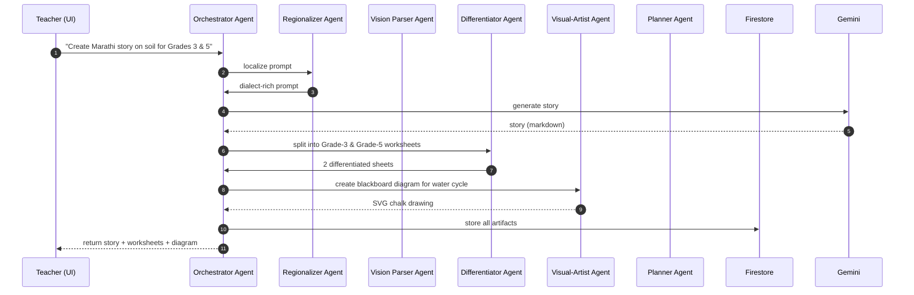
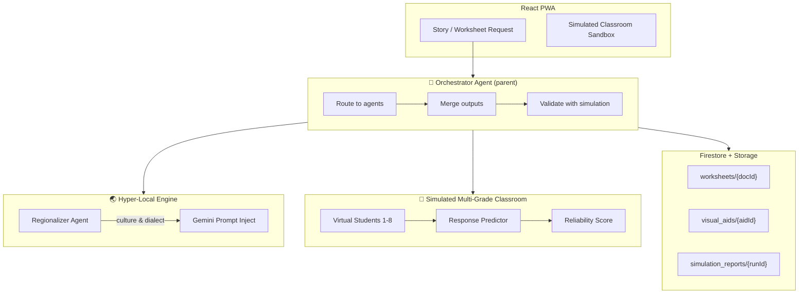

# VidyaNXT Force – Implementation Tracker

>Note: when ever get CORS error check firebase log file......

> Current deployment: [https://vidyanxt-c5816.web.app](https://vidyanxt-c5816.web.app)

---

## ✅ **COMPLETED** *(Already Shipped / Live)*

| # | Module / Feature | Evidence / Status |
|---|------------------|-------------------|
| 1 | **Live Prototype Web-App** | Fully deployed at [https://vidyanxt-c5816.web.app](https://vidyanxt-c5816.web.app) |
| 2 | **Peer-to-Peer Collaboration Network** | AI-powered **Strategic Peer Matching System** is functional |
| 3 | **Teacher Wellness & Sustainability Check** | Triggers on challenges posted + AI-peer communication |
| 4 | **Instant Knowledge Base / Simulated Mentor** | Quick-access educational resources + AI mentor ready |
| 5 | **UI / UX** | React.js + Tailwind CSS responsive web UI live |
| 6 | **Offline-First Data Storage** | IndexedDB already caching content for low-connectivity |
| 7 | **CI/CD Pipeline** | GitHub Actions auto-deploying every push |
| 8 | **Firebase Ecosystem** | Auth, Firestore, Hosting, Functions integrated |

---

## 🚧 **STILL TO IMPLEMENT / INCOMPLETE**

| # | Module / Feature | What’s Missing / Next Steps |
|---|------------------|-----------------------------|
| **A. AI-Powered Teaching Tools** |
| A1 | **Hyper-Local Content Generation** | • Fine-tune Gemini to inject **regional dialects & cultural examples** • Add **language selection & voice output** |
| A2 | **Multi-Grade Differentiation Engine** | • Build prompt-chain to **slice one lesson into 2–5 grade levels** • Add **difficulty slider / grade selector** in UI |
| A3 | **Instant Worksheet Differentiation** | • Integrate Google **Vision API** to parse textbook photo • Auto-create **print-ready PDF** worksheets |
| A4 | **AI Visual Aid Creator** | • Generate **blackboard-friendly diagrams** (SVG / PNG) • Offer **printable templates** |
| A5 | **Smart Lesson Planner** | • Calendar view for **multi-grade timetable** • Drag-and-drop resource allocation |
| **B. Collaborative Intelligence Network** |
| B1 | **Distributed Teaching Intelligence** | • Feed successful practices into **central embedding store** • Add **recommendation engine** to surface best practices |
| B2 | **Simulated Multi-Grade Classroom** | • Create **virtual student personas (Grades 1-8)** • Let teachers **test content** against simulated responses |
| B3 | **AI-Powered Teacher Training** | • Design **micro-learning modules** with progress badges • Integrate **peer mentorship** scheduling |
| **C. Sustainability & Wellness** |
| C1 | **Teacher Wellness Monitoring** | • Add **voice / text sentiment analysis** for stress detection • Push **peer-support notifications** |
| C2 | **Offline-First Sync** | • Background service-worker to **sync when connectivity returns** • Conflict-resolution for offline edits |
| **D. System & Orchestration** |
| D1 | **Agent Development Kit** | • Spin up **multi-agent orchestration** (Gemini + Gemma + custom agents) • Route tasks (content gen, wellness, training) to right agent |
| D2 | **Pub/Sub Messaging** | • Real-time **event bus** between agents, e.g., “new worksheet ready” |
| D3 | **Vertex AI Fine-Tuning** | • Upload **curated multi-grade dataset** to fine-tune Gemini |

---

### 🎯 **Quick-Win Checklist (Next 2 Weeks)**

1. Wire Vision API → Textbook-photo → Grade-specific worksheet (A3).  
2. Add language dropdown + sample regional story generator (A1).  
3. Create 3 virtual student personas for simulated classroom (B2).  
4. Implement service-worker offline-sync for worksheets (C2).

> Completing the checklist gives us a **minimum lovable product** ready for classroom pilots.

========================================================================================================================
========================================================================================================================
### 3.3 Sequence Diagram – Hyper-local Story & Worksheet Generation

| # | Agent                    | Core Responsibility                                                   | Re-uses Existing?           | New File                  |
| - | ------------------------ | --------------------------------------------------------------------- | --------------------------- | ------------------------- |
| 1 | **Regionalizer Agent**   | Injects dialect, cultural references & local examples into any prompt | —                           | `regionalizer-agent.js`   |
| 2 | **Vision Parser Agent**  | OCR + concept extraction from textbook photo via Google Vision        | ✅ `classification-agent.js` | extend inside             |
| 3 | **Differentiator Agent** | Prompt-chain to slice one lesson into 2-5 grade levels                | —                           | `differentiator-agent.js` |
| 4 | **Visual-Artist Agent**  | Converts concept → blackboard-friendly SVG/PNG         
| 2 | **Vision Parser Agent**  | OCR + concept extraction from textbook photo via Google Vision        | ✅ `classification-agent.js` | extend inside             |
| 3 | **Differentiator Agent** | Prompt-chain to slice one lesson into 2-5 grade levels                | —                           | `differentiator-agent.js` |
| 4 | **Visual-Artist Agent**  | Converts concept → blackboard-friendly SVG/PNG                        | —                           | `visual-artist-agent.js`  |
| 5 | **Planner Agent**        | Builds weekly multi-grade timetable & slots activities                | —                           | `planner-agent.js`        |
| 6 | **Orchestrator Agent**   | Routes requests, parallelizes agents, merges outputs                  | ✅ `orchestration-agent.js`  | extend                    |

3️⃣ Firestore Collections & Fields

| Collection                              | Fields (key ↔ type)                                                                                                | Purpose              |
| --------------------------------------- | ------------------------------------------------------------------------------------------------------------------ | -------------------- |
| **/teachers/{uid}**                     | `name`, `language`, `grades[]`, `district`, `state`, `lastLoginAt`                                                 | Teacher profile      |
| **/regional\_prompts/{lang}/{topic}**   | `promptTemplate`, `culturalSnippets[]`, `examples[]`                                                               | Prompt library       |
| **/worksheets/{docId}**                 | `teacherId`, `sourceImageURL`, `visionText`, `gradeLevels[]`, `worksheets[{grade, markdown, svgURL}]`, `createdAt` | Generated worksheets |
| **/visual\_aids/{aidId}**               | `concept`, `svgDataURL`, `pngURL`, `tags[]`, `grade`                                                               | Re-usable diagrams   |
| **/weekly\_plans/{teacherId}/{weekId}** | `startDate`, `slots[{day, period, grade, topic, activity, resourceURL}]`, `status`                                 | Auto-planner         |
| **/qna\_cache/{questionHash}**          | `question`, `answer`, `language`, `analogy`, `confidence`, `timestamp`                                             | Offline answers      |
| **/usage\_logs/{uid}/{yyyy-mm-dd}**     | `callsPerAgent`, `tokens`, `latency`, `errors[]`                                                                   | Cost & UX analytics  |

==========================================================================================================================================================================
==========================================================================================================================================================================
Plan.

📦 New / Extended Files
| Path                                           | Purpose                                                  | Extends / New  |
| ---------------------------------------------- | -------------------------------------------------------- | -------------- |
| `functions/src/agents/regionalizer-agent.js`   | Inject dialect & culture into any prompt                 | **New**        |
| `functions/src/agents/differentiator-agent.js` | Split one lesson into 2-5 grade levels                   | **New**        |
| `functions/src/agents/visual-artist-agent.js`  | Blackboard-friendly SVG/PNG                              | **New**        |
| `functions/src/agents/simulation-agent.js`     | Run virtual classroom & score reliability                | **New**        |
| `functions/src/agents/planner-agent.js`        | Weekly multi-grade timetable                             | **New**        |
| `functions/src/utils/regional-prompts/`        | JSON maps for each language                              | **New folder** |
| `src/pages/SimulatedClassroom.jsx`             | Live sandbox to preview content against virtual students | **New**        |
| `src/hooks/useRegionalPrompt.js`               | React hook for language dropdown                         | **New**        |

3. 🔧 Data Contracts (Firestore)
3.1 Virtual Students Collection
/simulated_students/{gradeId}
{
  grade: 1..8,
  personas: [
    {
      id: "g3_slow_reader",
      readingLevel: 2.1,
      attentionSpan: "medium",
      homeLang: "Marathi",
      misconceptions: ["Earth orbits the Sun daily"]
    }
  ]
}
3.2 Simulation Report
/simulation_reports/{runId}
{
  teacherId,
  contentId,
  virtualStudents: [...],
  reliabilityScore: 0.92,          // 0-1
  failurePoints: [
    { grade: 4, concept: "water-cycle", issue: "vocabulary too hard" }
  ],
  createdAt
}
3.3 Regional Prompt Cache
/regional_prompts/{langCode}/{topicSlug}
{
  dialectWords: { "soil": "माती" },
  culturalSnippets: ["Sant Tukaram story"],
  sampleStory: "Once upon a time in Kolhapur..."
}

<!-- Markdown Preview Mermaid Support -->